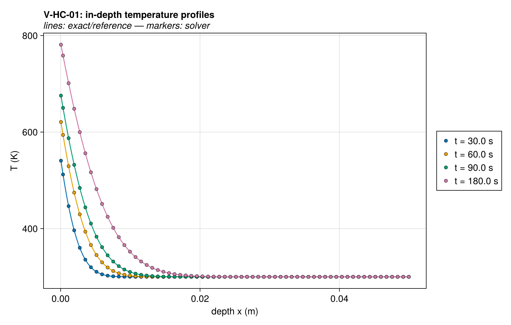
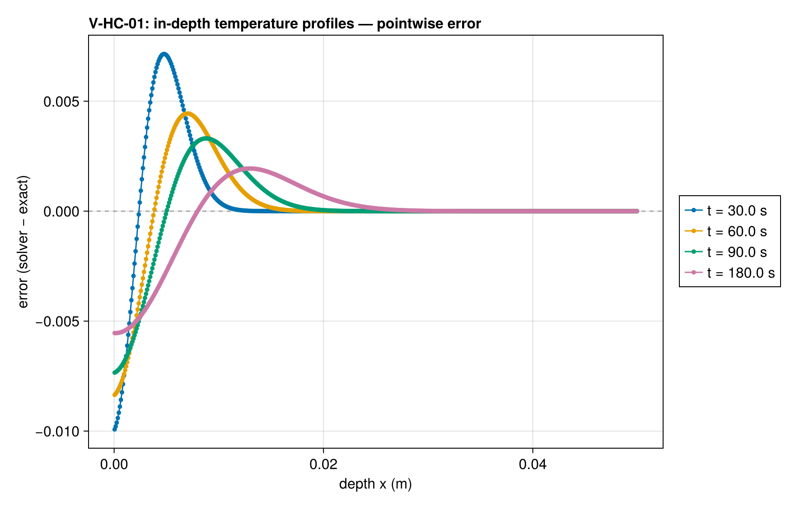
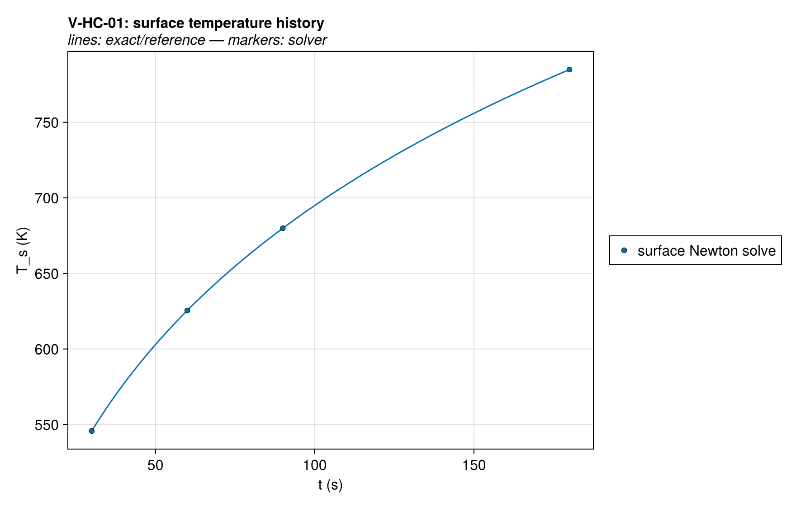
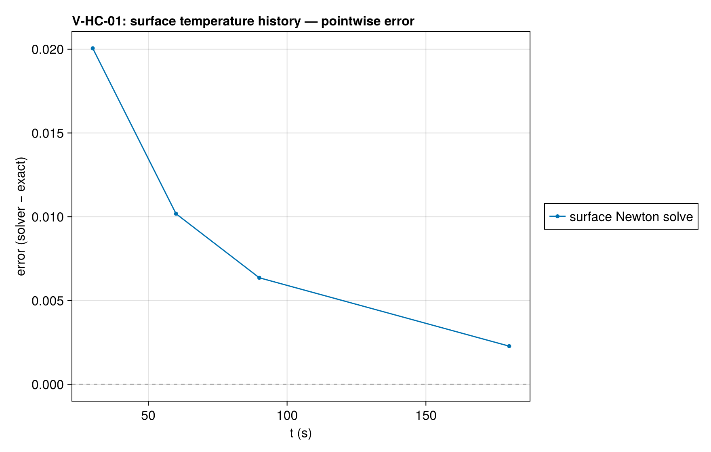
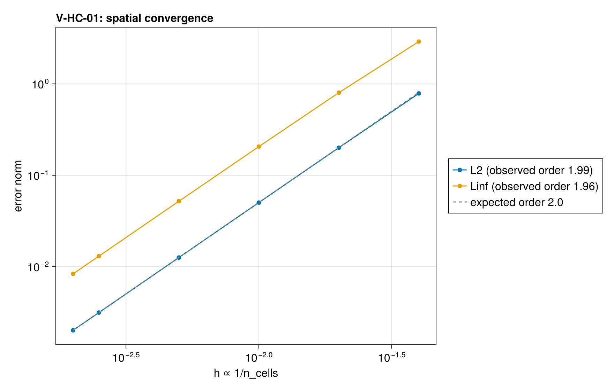
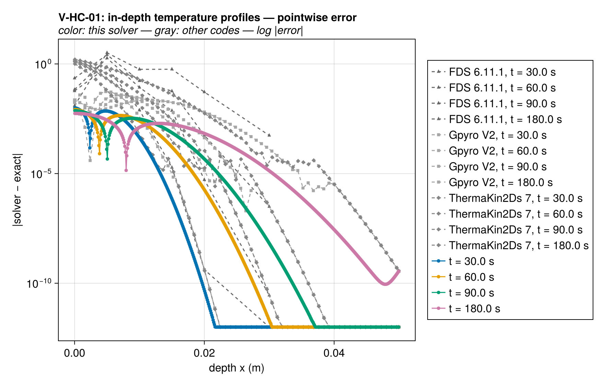
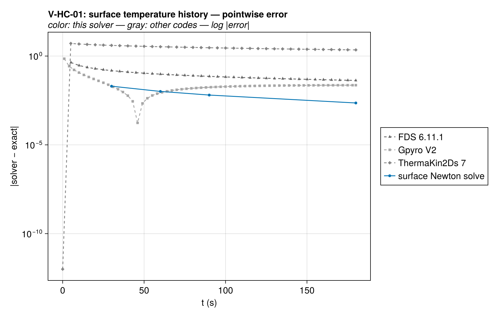
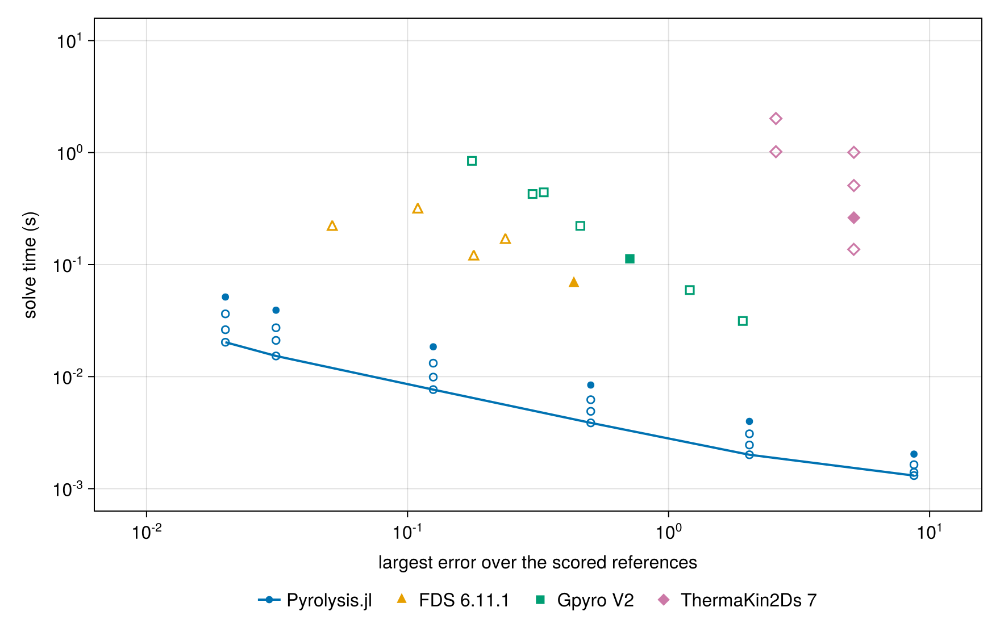

# V-HC-01 — semi-infinite solid, convective surface BC (erfc)

**Tags:** `heat_conduction`, `convective_bc`, `surface_newton`

**References:**

- Carslaw & Jaeger (1959), Conduction of Heat in Solids, §2.7
- Lautenberger dissertation (2007) §3.4.1 (parameters)
- FDS Verification Guide `ht3d_slab`; ThermaKin (FSS 9:1141) Eq. 25

## Problem statement

A semi-infinite conduction benchmark, using the parameters of
Lautenberger's dissertation §3.4.1 (ThermaKin Eq. 25 uses the same
analytical form with different parameters):
constant absorbed radiant flux q″ = 25 kW/m² plus convective exchange
h = 20 W/m²K with T∞ = T₀ = 300 K; k = 0.2 W/(m·K), ρ = 1000 kg/m³,
c = 1400 J/(kg·K), so profiles at t = 30/60/90/180 s are directly comparable
to the dissertation figures.

Because the combined surface BC is linear in T_s, absorbed-flux + convection
is exactly convection toward T∞_eff = T∞ + q″/h = 1550 K, and the Carslaw &
Jaeger §2.7 erfc solution (exact/semi_infinite.jl) applies unchanged.

Coverage beyond the existing Dirichlet erf test: `HeatFluxBC + ConvectiveBC`
enter the surface Newton solve, so the surface temperature is an unknown
coupled to the interior — the place surface-BC bugs live.

Domain: L = 5 cm ≫ thermal penetration (erfc(η) ≈ 3e-12 at the back face at
t = 180 s), so the finite slab is semi-infinite to well below the QoI
tolerances; the back-face-rise QoI enforces this assumption explicitly.

### Quantities of interest (n = 500)

| QoI | value | exact | error | tolerance | within tol | provenance |
| --- | --- | --- | --- | --- | --- | --- |
| L∞ T-profile error, t=30.0 s | 0.009925 | — | 0.009925 | 0.75 | yes | observed 0.24/0.21/0.18/0.14 K at t=30/60/90/180 s |
| L∞ T-profile error, t=60.0 s | 0.008354 | — | 0.008354 | 0.75 | yes | observed 0.24/0.21/0.18/0.14 K at t=30/60/90/180 s |
| L∞ T-profile error, t=90.0 s | 0.007341 | — | 0.007341 | 0.75 | yes | observed 0.24/0.21/0.18/0.14 K at t=30/60/90/180 s |
| L∞ T-profile error, t=180.0 s | 0.005543 | — | 0.005543 | 0.75 | yes | observed 0.24/0.21/0.18/0.14 K at t=30/60/90/180 s |
| surface temperature, t=30.0 s | 545.8 | 545.7 | 0.02005 | 1.5 | yes | surface Newton solve vs exact θ_s = 1 − erfcx(h√(αt)/k); observed 0.50/0.26/0.16/0.06 K at t=30/60/90/180 s |
| surface temperature, t=60.0 s | 625.5 | 625.5 | 0.01018 | 1.5 | yes | surface Newton solve vs exact θ_s = 1 − erfcx(h√(αt)/k); observed 0.50/0.26/0.16/0.06 K at t=30/60/90/180 s |
| surface temperature, t=90.0 s | 679.9 | 679.9 | 0.006359 | 1.5 | yes | surface Newton solve vs exact θ_s = 1 − erfcx(h√(αt)/k); observed 0.50/0.26/0.16/0.06 K at t=30/60/90/180 s |
| surface temperature, t=180.0 s | 784.9 | 784.9 | 0.002279 | 1.5 | yes | surface Newton solve vs exact θ_s = 1 − erfcx(h√(αt)/k); observed 0.50/0.26/0.16/0.06 K at t=30/60/90/180 s |
| back-face rise (semi-infinite validity) | 7.191e-10 | 0 | 7.191e-10 | 1e-06 | yes | guards the semi-infinite assumption of the reference solution |

### Comparison with other codes

Physical-problem agreement does not establish equal discretization or cost. See the [mesh and time comparison basis](comparison_coverage.md#comparison-basis-audit) and [per-pair inventory](assets/comparison_basis.csv). Costs are compared at matched accuracy only.

Matched native-input runs at seven configurations (coarser and finer time steps at fixed mesh, and a finer mesh) are retained under `test/verification/reference/matched/`. See the [coverage and matching notes](comparison_coverage.md). The plotted external series use the base resolution; [analytical errors at every configuration](assets/V-HC-01/V-HC-01_comparison_accuracy.csv) are retained separately, and the same runs are timed for the cost comparison.

FDS 6.11.1 and Gpyro V2 revision `bff0126c68f2` use 500 intervals (0.1 mm) at dt = 0.1 s. FDS has no pure flux face on a conducting material; the absorbed flux with convective loss is convection to T∞ + q″/h = 1550 K, which is the same boundary condition. Its profile values are cell centers. Gpyro's are boundary-centered nodes with half control volumes at both faces. ThermaKin2Ds 7 uses 500 uniform elements (0.1 mm) at a fixed dt = 0.1 s. It has no pure flux boundary, so the absorbed flux is incident radiation q″/ε on the exposed element with ε = 1e-8; re-radiation stays below 1e-3 W/m². Its surface temperature is the boundary-element center value, 0.05 mm below the face.

Error panels show absolute error at each code's output points. Zeros are displayed at 1e-12 on the logarithmic axis; the reference CSV precision limits the discernible error.

#### Cost at matched accuracy

Each external code appears at its matched mesh h and time step Δt, at
coarser steps (2Δt, 4Δt) and at refinements (Δt/2, Δt/4, h/2 at Δt/4,
h/2 at Δt/2); this code at its report ladder, the external meshes and any
finer cost-only meshes, each at its report tolerances and at 10, 100 and
1000 times looser ones, the counterpart of the coarser steps. A coarse
configuration a code cannot express or complete is left out; for the
external codes the reason is in the matched provenance. The error is the
largest analytical error over
the curves and references the external run is scored on. Times are FDS's
internal elapsed time, which excludes its MPI start-up; Gpyro's and
ThermaKin's process time; and this code's warm problem construction and
solve. Each is the median of repeated runs on one pinned core
(`scripts/timing/README.md`; data and provenance in
`test/verification/reference/matched/timing/`). On the smallest problems
the external times are mostly input, setup and output. In the figure,
filled markers are each external code's matched mesh and step and this
code's report tolerances, open markers are the other runs, and this
code's line joins its cheapest configuration at each accuracy; lower left
is better. Errors at or below 1e-12 count as exact
when matching accuracy, errors at or below 1e-14 are drawn at 1e-14, and
runs every code solves exactly are not drawn.

For each external mesh and step: the external code's cheapest run at least as accurate (often itself; a coarser or finer run of the same code when that costs less), this code's cheapest configuration at least as accurate on every scored reference (its cells, and its tolerance multiplier when looser than the report's), and the ratio of the two. A ratio marked ≥ uses this code's coarsest configuration, fewest cells at the loosest tolerance, whose accuracy already exceeds the external run's.

| External run | Mesh, step | External error | External time (s) | Cheapest external at this accuracy (s) | Our cells, tolerance | Our time (s) | Cheapest external/our time |
| --- | --- | --- | --- | --- | --- | --- | --- |
| FDS 6.11.1 | h, Δt | 0.4336 | 0.068 | 0.068 | 200, 1000× tol | 0.00766 | 8.88 |
| FDS 6.11.1 | h, Δt/2 | 0.1793 | 0.118 | 0.118 | 200, 1000× tol | 0.00766 | 15.4 |
| FDS 6.11.1 | h, Δt/4 | 0.05147 | 0.217 | 0.217 | 400, 1000× tol | 0.01529 | 14.2 |
| FDS 6.11.1 | h/2, Δt/4 | 0.1094 | 0.31 | 0.217 | 400, 1000× tol | 0.01529 | 14.2 |
| FDS 6.11.1 | h/2, Δt/2 | 0.237 | 0.166 | 0.118 | 200, 1000× tol | 0.00766 | 15.4 |
| Gpyro V2 | h, Δt | 0.7104 | 0.1128 | 0.1128 | 100, 1000× tol | 0.003868 | 29.2 |
| Gpyro V2 | h, 2Δt | 1.206 | 0.05927 | 0.05927 | 100, 1000× tol | 0.003868 | 15.3 |
| Gpyro V2 | h, 4Δt | 1.924 | 0.0314 | 0.0314 | 100, 1000× tol | 0.003868 | 8.12 |
| Gpyro V2 | h, Δt/2 | 0.4591 | 0.2218 | 0.2218 | 200, 1000× tol | 0.00766 | 29.0 |
| Gpyro V2 | h, Δt/4 | 0.3325 | 0.4419 | 0.4273 | 200, 1000× tol | 0.00766 | 55.8 |
| Gpyro V2 | h/2, Δt/4 | 0.1765 | 0.8436 | 0.8436 | 200, 1000× tol | 0.00766 | 110.0 |
| Gpyro V2 | h/2, Δt/2 | 0.3012 | 0.4273 | 0.4273 | 200, 1000× tol | 0.00766 | 55.8 |
| ThermaKin2Ds 7 | h, Δt | 5.126 | 0.2623 | 0.1369 | 50, 1000× tol | 0.002008 | 68.2 |
| ThermaKin2Ds 7 | h, 2Δt | 5.121 | 0.1369 | 0.1369 | 50, 1000× tol | 0.002008 | 68.2 |
| ThermaKin2Ds 7 | h, Δt/2 | 5.127 | 0.5083 | 0.1369 | 50, 1000× tol | 0.002008 | 68.2 |
| ThermaKin2Ds 7 | h, Δt/4 | 5.127 | 1.005 | 0.1369 | 50, 1000× tol | 0.002008 | 68.2 |
| ThermaKin2Ds 7 | h/2, Δt/4 | 2.577 | 2.016 | 1.019 | 50, 1000× tol | 0.002008 | 507.0 |
| ThermaKin2Ds 7 | h/2, Δt/2 | 2.577 | 1.019 | 1.019 | 50, 1000× tol | 0.002008 | 507.0 |

Solution overlays including the other codes' points: [T_profiles_vs_codes](assets/V-HC-01/V-HC-01_T_profiles_vs_codes.png), [surface_T_history_vs_codes](assets/V-HC-01/V-HC-01_surface_T_history_vs_codes.png).

### Convergence

| n_cells | h | wall (s) | L2 | Linf |
| --- | --- | --- | --- | --- |
| 25 | 0.04 | 0.001988 | 0.7857 | 2.901 |
| 50 | 0.02 | 0.004004 | 0.2003 | 0.8012 |
| 100 | 0.01 | 0.008185 | 0.05027 | 0.2059 |
| 200 | 0.005 | 0.01757 | 0.01258 | 0.05197 |
| 400 | 0.0025 | 0.03771 | 0.003146 | 0.01304 |
| 500 | 0.002 | 0.04835 | 0.002013 | 0.008354 |

Wall time: median of up to five warm runs of problem construction and solve on one pinned core, after a discarded compiling run.

Observed order 1.993 (L2), expected 2.0.

### Solver configuration

| setting | value |
| --- | --- |
| integrator | Rodas5P (default) |
| abstol | 1.0e-12 |
| reltol | 1.0e-10 |
