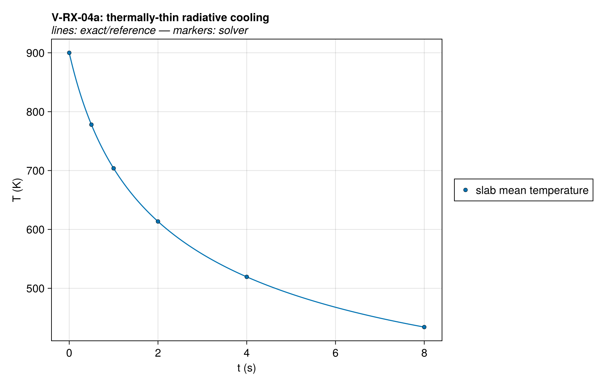
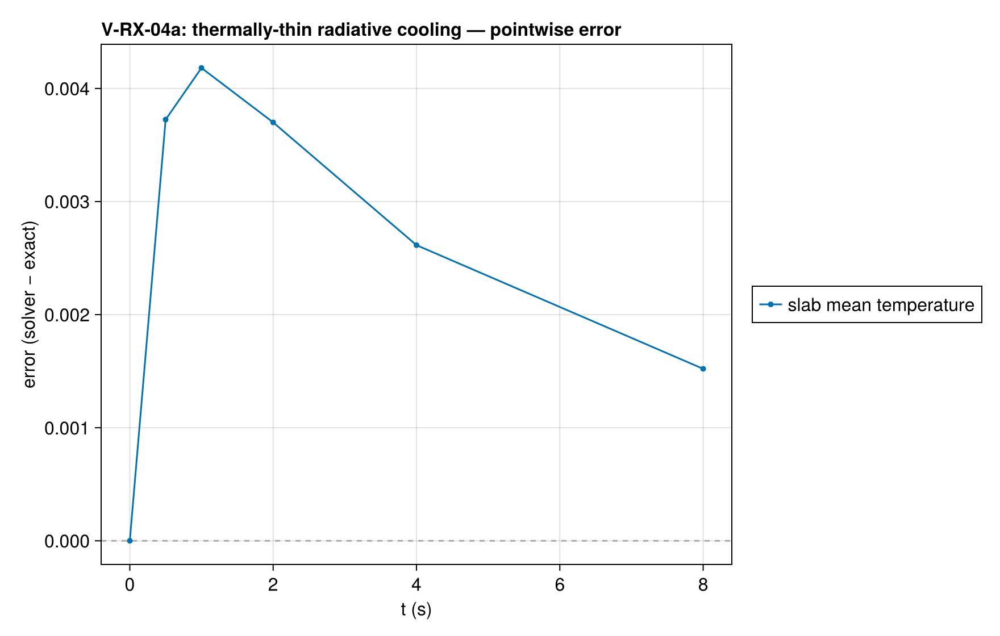
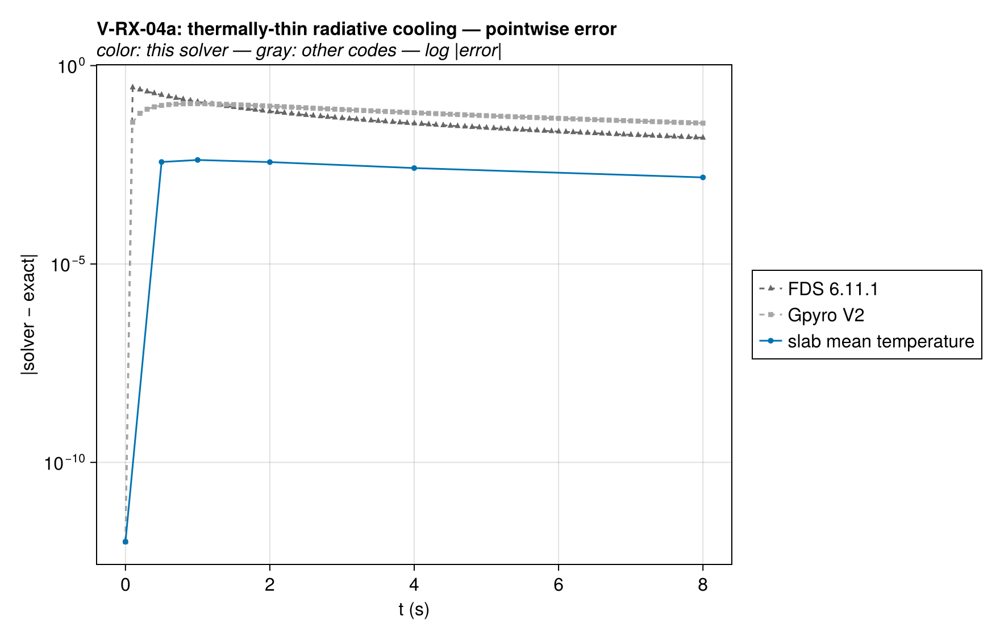
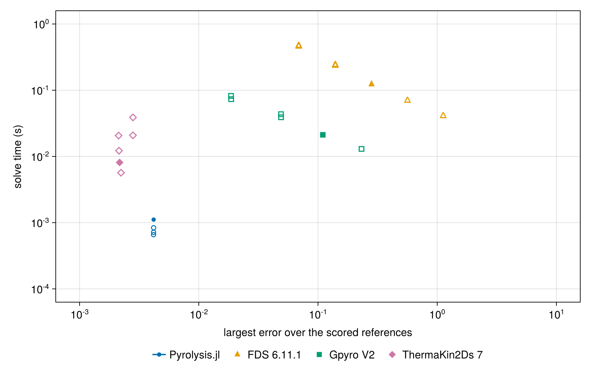
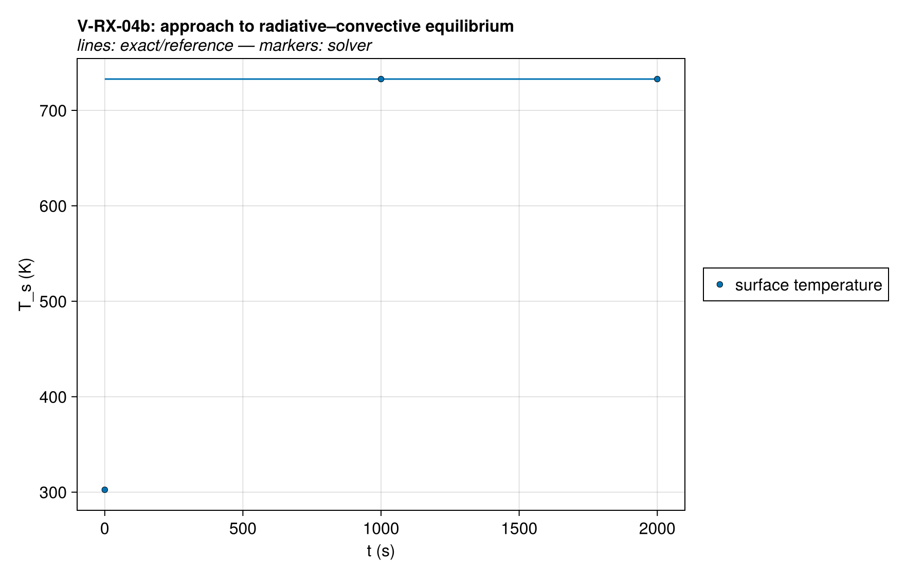
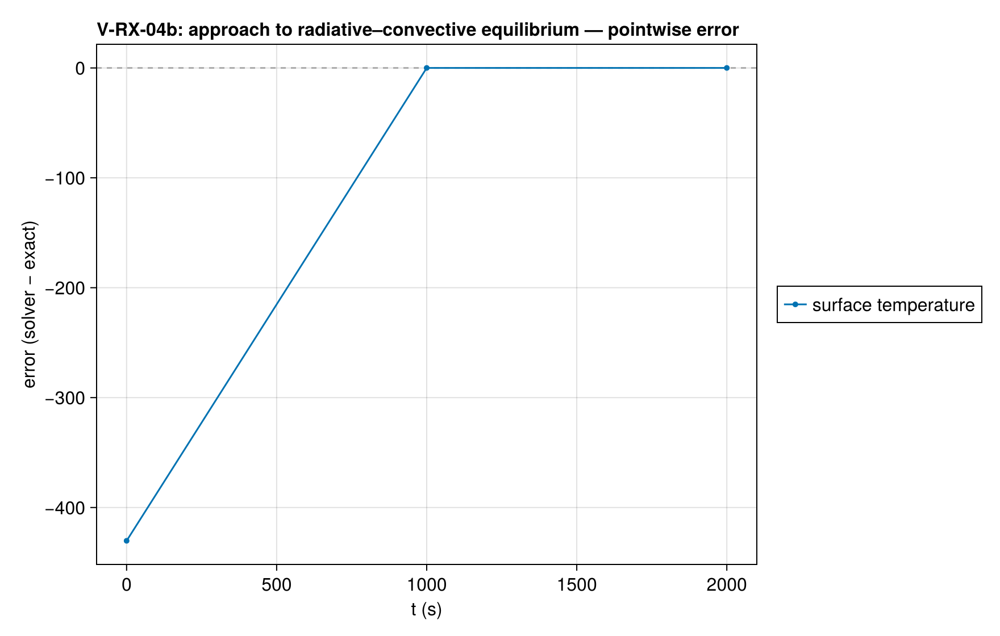
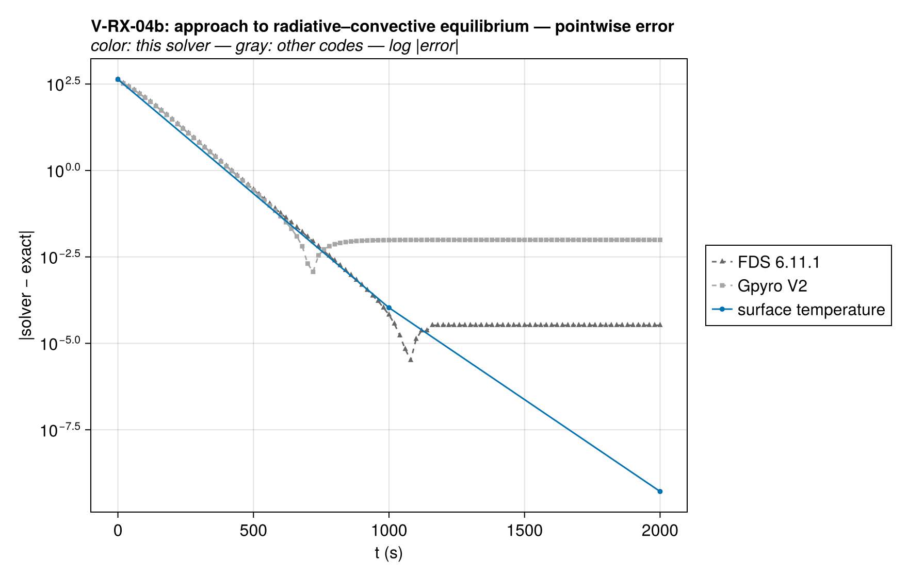
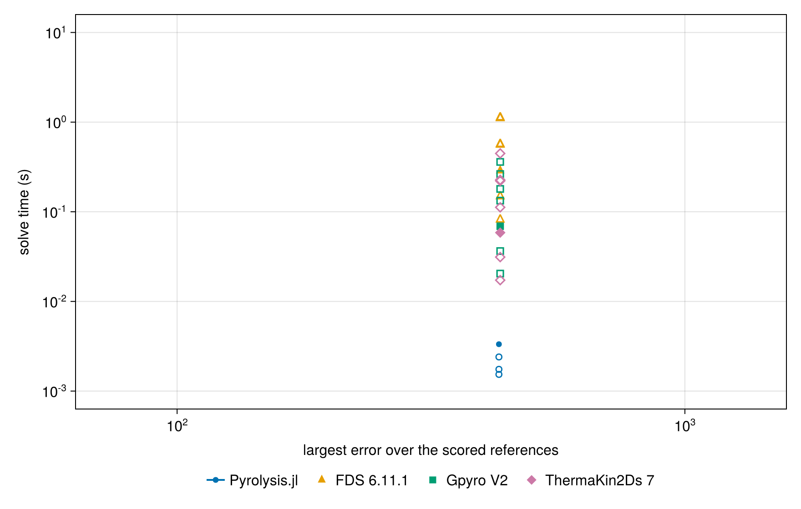

# V-RX-04 — thermally-thin radiative cooling (implicit exact)

**Tags:** `radiation`, `radiative_bc`, `surface_newton`, `thermally_thin`

**References:**

- partial-fraction antiderivative re-derived in exact/radiative_cooling.jl

## Problem statement

surface equilibrium

The only closed-form transient involving the T⁴ nonlinearity: a thin slab
cooling purely by radiation, dT/dt = −K(T⁴−T∞⁴) with K = εσ/(ρcL), exact
implicit solution t = (G(Tᵢ)−G(T))/K (exact/radiative_cooling.jl, quadrature
self-tested). Verifies `RadiativeBC` + the surface Newton solve against
something other than steady algebra.

  a) transient cooling — thin-limit setup: L = 0.1 mm, k = 100 W/mK makes
     the internal ΔT ≈ q·L/2k ≈ 0.017 K at t = 0 (flux bias ~7e-5 relative),
     far below the comparison tolerance; compared on the cell-mean
     temperature, which is what the lumped ODE governs.
  b) steady companion — HeatFluxBC + RadiativeBC + ConvectiveBC vs the exact
     algebraic root of q_abs = εσ(Ts⁴−T∞⁴) + h(Ts−T∞): a direct check of
     the surface-Newton residual (Ts ≈ 732 K, cone-like). Run to 36 thermal
     time constants; at steady state with an adiabatic back the whole slab
     must be uniform at Ts.

Uses the code's own STEFAN_BOLTZMANN so the reference cannot drift from the
implementation's constant.

## V-RX-04a — thermally-thin radiative cooling (implicit exact)

### Quantities of interest (n = 4)

| QoI | value | exact | error | tolerance | within tol | provenance |
| --- | --- | --- | --- | --- | --- | --- |
| max mean-T error vs implicit exact | 0.004182 | — | 0.004182 | 0.012 | yes | lumped T⁴ cooling; thin-limit bias ~7e-5 relative in flux |
| internal ΔT (thin-limit validity) | 0.006854 | — | 0.006854 | 0.05 | yes | guards the lumped assumption of the reference solution |

### Comparison with other codes

Physical-problem agreement does not establish equal discretization or cost. See the [mesh and time comparison basis](comparison_coverage.md#comparison-basis-audit) and [per-pair inventory](assets/comparison_basis.csv). Costs are compared at matched accuracy only.

Matched native-input runs at seven configurations (coarser and finer time steps at fixed mesh, and a finer mesh) are retained under `test/verification/reference/matched/`. See the [coverage and matching notes](comparison_coverage.md). The plotted external series use the base resolution; [analytical errors at every configuration](assets/V-RX-04a/V-RX-04a_comparison_accuracy.csv) are retained separately, and the same runs are timed for the cost comparison.

Error panels show absolute error at each code's output points. Zeros are displayed at 1e-12 on the logarithmic axis; the reference CSV precision limits the discernible error.

#### Cost at matched accuracy

Each external code appears at its matched mesh h and time step Δt, at
coarser steps (2Δt, 4Δt) and at refinements (Δt/2, Δt/4, h/2 at Δt/4,
h/2 at Δt/2); this code at its report ladder, the external meshes and any
finer cost-only meshes, each at its report tolerances and at 10, 100 and
1000 times looser ones, the counterpart of the coarser steps. A coarse
configuration a code cannot express or complete is left out; for the
external codes the reason is in the matched provenance. The error is the
largest analytical error over
the curves and references the external run is scored on. Times are FDS's
internal elapsed time, which excludes its MPI start-up; Gpyro's and
ThermaKin's process time; and this code's warm problem construction and
solve. Each is the median of repeated runs on one pinned core
(`scripts/timing/README.md`; data and provenance in
`test/verification/reference/matched/timing/`). On the smallest problems
the external times are mostly input, setup and output. In the figure,
filled markers are each external code's matched mesh and step and this
code's report tolerances, open markers are the other runs, and this
code's line joins its cheapest configuration at each accuracy; lower left
is better. Errors at or below 1e-12 count as exact
when matching accuracy, errors at or below 1e-14 are drawn at 1e-14, and
runs every code solves exactly are not drawn.

For each external mesh and step: the external code's cheapest run at least as accurate (often itself; a coarser or finer run of the same code when that costs less), this code's cheapest configuration at least as accurate on every scored reference (its cells, and its tolerance multiplier when looser than the report's), and the ratio of the two. A ratio marked ≥ uses this code's coarsest configuration, fewest cells at the loosest tolerance, whose accuracy already exceeds the external run's.

| External run | Mesh, step | External error | External time (s) | Cheapest external at this accuracy (s) | Our cells, tolerance | Our time (s) | Cheapest external/our time |
| --- | --- | --- | --- | --- | --- | --- | --- |
| FDS 6.11.1 | h, Δt | 0.2813 | 0.123 | 0.123 | 4, 1000× tol | 0.000659 | ≥ 187.0 |
| FDS 6.11.1 | h, 2Δt | 0.5631 | 0.07 | 0.07 | 4, 1000× tol | 0.000659 | ≥ 106.0 |
| FDS 6.11.1 | h, 4Δt | 1.122 | 0.041 | 0.041 | 4, 1000× tol | 0.000659 | ≥ 62.2 |
| FDS 6.11.1 | h, Δt/2 | 0.1397 | 0.236 | 0.236 | 4, 1000× tol | 0.000659 | ≥ 358.0 |
| FDS 6.11.1 | h, Δt/4 | 0.06894 | 0.46 | 0.46 | 4, 1000× tol | 0.000659 | ≥ 698.0 |
| FDS 6.11.1 | h/2, Δt/4 | 0.06891 | 0.473 | 0.473 | 4, 1000× tol | 0.000659 | ≥ 718.0 |
| FDS 6.11.1 | h/2, Δt/2 | 0.1397 | 0.243 | 0.243 | 4, 1000× tol | 0.000659 | ≥ 369.0 |
| Gpyro V2 | h, Δt | 0.1098 | 0.0212 | 0.0212 | 4, 1000× tol | 0.000659 | ≥ 32.2 |
| Gpyro V2 | h, 2Δt | 0.2318 | 0.01299 | 0.01299 | 4, 1000× tol | 0.000659 | ≥ 19.7 |
| Gpyro V2 | h, Δt/2 | 0.04898 | 0.03906 | 0.03906 | 4, 1000× tol | 0.000659 | ≥ 59.3 |
| Gpyro V2 | h, Δt/4 | 0.01869 | 0.07324 | 0.07324 | 4, 1000× tol | 0.000659 | ≥ 111.0 |
| Gpyro V2 | h/2, Δt/4 | 0.01864 | 0.08213 | 0.08213 | 4, 1000× tol | 0.000659 | ≥ 125.0 |
| Gpyro V2 | h/2, Δt/2 | 0.04894 | 0.04348 | 0.04348 | 4, 1000× tol | 0.000659 | ≥ 66.0 |
| ThermaKin2Ds 7 | h, Δt | 0.002166 | 0.008108 | 0.008108 | not reached | — | — |
| ThermaKin2Ds 7 | h, 2Δt | 0.002225 | 0.005676 | 0.005676 | not reached | — | — |
| ThermaKin2Ds 7 | h, Δt/2 | 0.00214 | 0.01221 | 0.01221 | not reached | — | — |
| ThermaKin2Ds 7 | h, Δt/4 | 0.002125 | 0.02068 | 0.02068 | not reached | — | — |
| ThermaKin2Ds 7 | h/2, Δt/4 | 0.002804 | 0.03885 | 0.005676 | not reached | — | — |
| ThermaKin2Ds 7 | h/2, Δt/2 | 0.002804 | 0.02082 | 0.005676 | not reached | — | — |

Solution overlays including the other codes' points: [T_history_vs_exact_vs_codes](assets/V-RX-04a/V-RX-04a_T_history_vs_exact_vs_codes.png).

### Solver configuration

| setting | value |
| --- | --- |
| integrator | Rodas5P (default) |
| abstol | 1.0e-10 |
| reltol | 1.0e-8 |

## V-RX-04b — steady radiative–convective surface equilibrium

### Quantities of interest (n = 20)

| QoI | value | exact | error | tolerance | within tol | provenance |
| --- | --- | --- | --- | --- | --- | --- |
| steady surface temperature vs algebraic root | 732.8 | 732.8 | 5.191e-10 | 1e-06 | yes | surface-Newton residual check; Ts_exact ≈ 732.8 K |
| steadiness (last half-interval drift) | 0.0001073 | — | 0.0001073 | 0.001 | yes | t_end ≈ 36 thermal time constants |
| steady uniformity (adiabatic back) | 3.297e-12 | — | 3.297e-12 | 1e-07 | yes | zero steady flux ⇒ uniform slab at Ts |

### Comparison with other codes

Physical-problem agreement does not establish equal discretization or cost. See the [mesh and time comparison basis](comparison_coverage.md#comparison-basis-audit) and [per-pair inventory](assets/comparison_basis.csv). Costs are compared at matched accuracy only.

Matched native-input runs at seven configurations (coarser and finer time steps at fixed mesh, and a finer mesh) are retained under `test/verification/reference/matched/`. See the [coverage and matching notes](comparison_coverage.md). The plotted external series use the base resolution; [analytical errors at every configuration](assets/V-RX-04b/V-RX-04b_comparison_accuracy.csv) are retained separately, and the same runs are timed for the cost comparison.

Error panels show absolute error at each code's output points. Zeros are displayed at 1e-12 on the logarithmic axis; the reference CSV precision limits the discernible error.

#### Cost at matched accuracy

Each external code appears at its matched mesh h and time step Δt, at
coarser steps (2Δt, 4Δt) and at refinements (Δt/2, Δt/4, h/2 at Δt/4,
h/2 at Δt/2); this code at its report ladder, the external meshes and any
finer cost-only meshes, each at its report tolerances and at 10, 100 and
1000 times looser ones, the counterpart of the coarser steps. A coarse
configuration a code cannot express or complete is left out; for the
external codes the reason is in the matched provenance. The error is the
largest analytical error over
the curves and references the external run is scored on. Times are FDS's
internal elapsed time, which excludes its MPI start-up; Gpyro's and
ThermaKin's process time; and this code's warm problem construction and
solve. Each is the median of repeated runs on one pinned core
(`scripts/timing/README.md`; data and provenance in
`test/verification/reference/matched/timing/`). On the smallest problems
the external times are mostly input, setup and output. In the figure,
filled markers are each external code's matched mesh and step and this
code's report tolerances, open markers are the other runs, and this
code's line joins its cheapest configuration at each accuracy; lower left
is better. Errors at or below 1e-12 count as exact
when matching accuracy, errors at or below 1e-14 are drawn at 1e-14, and
runs every code solves exactly are not drawn.

For each external mesh and step: the external code's cheapest run at least as accurate (often itself; a coarser or finer run of the same code when that costs less), this code's cheapest configuration at least as accurate on every scored reference (its cells, and its tolerance multiplier when looser than the report's), and the ratio of the two. A ratio marked ≥ uses this code's coarsest configuration, fewest cells at the loosest tolerance, whose accuracy already exceeds the external run's.

| External run | Mesh, step | External error | External time (s) | Cheapest external at this accuracy (s) | Our cells, tolerance | Our time (s) | Cheapest external/our time |
| --- | --- | --- | --- | --- | --- | --- | --- |
| FDS 6.11.1 | h, Δt | 432.8 | 0.288 | 0.082 | 20, 1000× tol | 0.001439 | ≥ 57.0 |
| FDS 6.11.1 | h, 2Δt | 432.8 | 0.149 | 0.082 | 20, 1000× tol | 0.001439 | ≥ 57.0 |
| FDS 6.11.1 | h, 4Δt | 432.8 | 0.082 | 0.082 | 20, 1000× tol | 0.001439 | ≥ 57.0 |
| FDS 6.11.1 | h, Δt/2 | 432.8 | 0.562 | 0.082 | 20, 1000× tol | 0.001439 | ≥ 57.0 |
| FDS 6.11.1 | h, Δt/4 | 432.8 | 1.111 | 0.082 | 20, 1000× tol | 0.001439 | ≥ 57.0 |
| FDS 6.11.1 | h/2, Δt/4 | 432.8 | 1.131 | 0.082 | 20, 1000× tol | 0.001439 | ≥ 57.0 |
| FDS 6.11.1 | h/2, Δt/2 | 432.8 | 0.571 | 0.082 | 20, 1000× tol | 0.001439 | ≥ 57.0 |
| Gpyro V2 | h, Δt | 432.8 | 0.06904 | 0.02044 | 20, 1000× tol | 0.001439 | ≥ 14.2 |
| Gpyro V2 | h, 2Δt | 432.8 | 0.03646 | 0.02044 | 20, 1000× tol | 0.001439 | ≥ 14.2 |
| Gpyro V2 | h, 4Δt | 432.8 | 0.02044 | 0.02044 | 20, 1000× tol | 0.001439 | ≥ 14.2 |
| Gpyro V2 | h, Δt/2 | 432.8 | 0.1332 | 0.02044 | 20, 1000× tol | 0.001439 | ≥ 14.2 |
| Gpyro V2 | h, Δt/4 | 432.8 | 0.2636 | 0.02044 | 20, 1000× tol | 0.001439 | ≥ 14.2 |
| Gpyro V2 | h/2, Δt/4 | 432.8 | 0.36 | 0.02044 | 20, 1000× tol | 0.001439 | ≥ 14.2 |
| Gpyro V2 | h/2, Δt/2 | 432.8 | 0.1798 | 0.02044 | 20, 1000× tol | 0.001439 | ≥ 14.2 |
| ThermaKin2Ds 7 | h, Δt | 432.8 | 0.05854 | 0.01727 | 20, 1000× tol | 0.001439 | ≥ 12.0 |
| ThermaKin2Ds 7 | h, 2Δt | 432.8 | 0.03123 | 0.01727 | 20, 1000× tol | 0.001439 | ≥ 12.0 |
| ThermaKin2Ds 7 | h, 4Δt | 432.8 | 0.01727 | 0.01727 | 20, 1000× tol | 0.001439 | ≥ 12.0 |
| ThermaKin2Ds 7 | h, Δt/2 | 432.8 | 0.1121 | 0.01727 | 20, 1000× tol | 0.001439 | ≥ 12.0 |
| ThermaKin2Ds 7 | h, Δt/4 | 432.8 | 0.2212 | 0.01727 | 20, 1000× tol | 0.001439 | ≥ 12.0 |
| ThermaKin2Ds 7 | h/2, Δt/4 | 432.8 | 0.4472 | 0.01727 | 20, 1000× tol | 0.001439 | ≥ 12.0 |
| ThermaKin2Ds 7 | h/2, Δt/2 | 432.8 | 0.2269 | 0.01727 | 20, 1000× tol | 0.001439 | ≥ 12.0 |

Solution overlays including the other codes' points: [surface_T_history_vs_codes](assets/V-RX-04b/V-RX-04b_surface_T_history_vs_codes.png).

### Solver configuration

| setting | value |
| --- | --- |
| integrator | Rodas5P (default) |
| abstol | 1.0e-10 |
| reltol | 1.0e-8 |
